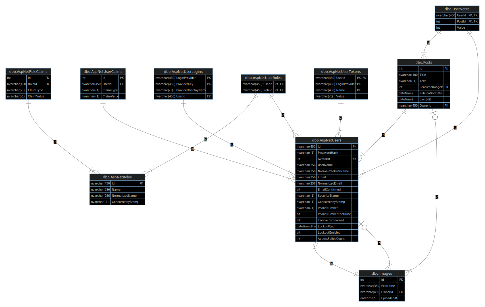

# Descrição

Uma pequena API REST para postar reviews sobre qualquer coisa (mas no caso, jogos). O sistema provê gerenciar usuários, criar posts, enviar imagens e adicionar votos nos posts criados.

O Identity foi usado para auxiliar na parte de gerenciamento e segurança de contas, assim como nos mecanismos de logar e deslogar. Além disso, o sistema já começa com um usuário Admnistrador, que tem 
super permissões. O seu login e senha são 'Admin' e 'Admin1234', respectivamente.

O OData foi usado para prover consultas GET, assim o client pode fazer várias consultas complexas envolvendo qualquer entidade.

# Anatomia do Sistema

Basicamente o controlador recebe a requisição, faz a validação dos dados, passa para a camada Repository que faz as operações no Context do EF Core e depois retorna de volta para o controlador processar a resposta. Portanto há a camada de controlador, validação, repository e de banco de dados com o EF Core, além de algum serviços adicionais.

Modelo Entidade Relacionamento:

# Testes

Os testes são divididos em dois: Integração e Unitário. Os de integração se encarregam mais de testar o que o controlador deve devolver ao cliente de acordo com a devida entrada de dados, já o de unidade testa pequenas partes. Neste sistema foi usado mais para testar os serviços, mais especificamente o serviço de armazenar imagens.

Algumas classes auxiliares foram criadas e dispostas nos namespace Helpers e Fixture. Os testes foram projetados para serem autossuficiente, sem reutilizar a chamar funções que são são Fact, Theory ou qualquer variante disto. Vale lembrar que executar todos os testes de uma vez causa resultados estranhos, deve ser por causa do paralelismo do XUnit.

Para executar os testes de integração é necessário alterar para true a constante `const bool UseTestDb = true;` dentro de `Program.cs`. Os testes de integração são feito em um banco de dados separado.

# Como rodar

O projeto é dockerizado com docker-compose junto com o banco de dados SQL Server, portanto o Docker é necessário para rodar sem fazer alterações.

1. Clone
2. Entre no .sln
3. No Visual Studio, verifique se o Contexto de Projeto (opções para fazer o run) é Debug e docker-compose.
4. Run
